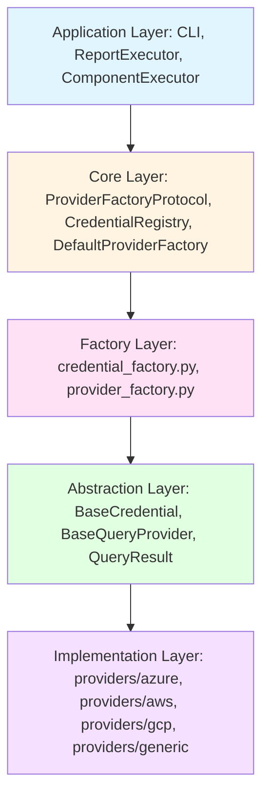
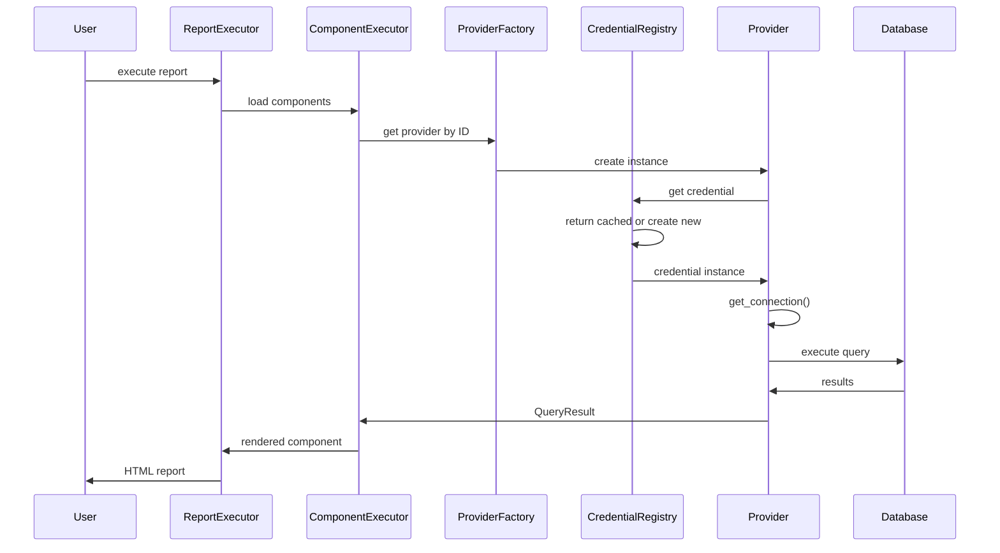

# QueryHub Multi-Cloud Architecture

## Overview

QueryHub has been refactored to support multiple cloud providers with a clean separation of concerns following SOLID principles. Credentials are now reusable entities, separate from providers, enabling better security, maintainability, and flexibility.

## Key Design Principles

### 1. Single Responsibility Principle (SRP)
- **Credentials**: Handle authentication only - return connection objects
- **Providers**: Execute queries only - accept queries and return results
- **Factories**: Create instances only - route to correct implementations
- **Registry**: Manage lifecycle only - cache and resolve credentials

### 2. Open/Closed Principle (OCP)
- New cloud providers can be added without modifying existing code
- New credential strategies can be added by implementing `BaseCredential`
- New query providers can be added by implementing `BaseQueryProvider`

### 3. Dependency Inversion Principle (DIP)
- All components depend on abstractions (`BaseCredential`, `BaseQueryProvider`)
- Concrete implementations are injected via factories
- No direct dependencies on cloud-specific SDKs in core code

## Architecture Layers



## Component Details

### Base Abstractions

#### `BaseCredential[TConnection]`
```python
class BaseCredential(ABC, Generic[TConnection]):
    """Base class for all credentials with single responsibility: get connection."""
    
    @abstractmethod
    async def get_connection(self, **context) -> TConnection:
        """Return connection object for this credential type."""
        pass
```

**Implementations:**
- **Azure**: Returns `KustoConnectionStringBuilder`, `TokenCredential`, or tokens
- **AWS**: Returns configured `boto3` clients
- **GCP**: Returns `bigquery.Client` or `storage.Client`
- **Generic**: Returns connection strings, dicts, or `None`

#### `BaseQueryProvider`
```python
class BaseQueryProvider(ABC):
    """Base class for all query providers with single responsibility: execute queries."""
    
    @abstractmethod
    async def execute(self, query: str, **params) -> QueryResult:
        """Execute query and return results."""
        pass
```

**Implementations:**
- `ADXQueryProvider`: Executes KQL queries against Azure Data Explorer
- `SQLQueryProvider`: Executes SQL queries using SQLAlchemy
- `RESTQueryProvider`: Makes HTTP requests to REST APIs
- `CSVQueryProvider`: Reads data from CSV files

### Credential Registry

The `CredentialRegistry` is the central component for credential management:

```python
class CredentialRegistry:
    """Manages credential lifecycle with lazy initialization and caching."""
    
    def __init__(self):
        self._configs: dict[str, Any] = {}
        self._instances: dict[str, BaseCredential] = {}
    
    async def get_credential(self, credential_id: str) -> BaseCredential:
        """Get credential instance (creates and caches on first access)."""
        if credential_id not in self._instances:
            config = self._configs[credential_id]
            self._instances[credential_id] = await create_credential(config)
        return self._instances[credential_id]
```

**Benefits:**
- **Lazy Loading**: Credentials are created only when needed
- **Caching**: Same credential instance reused across multiple providers
- **Isolation**: Each credential is independent and testable
- **Security**: Credentials centralized in one secure location

### Factory Pattern

#### Credential Factory
Routes credential creation based on cloud provider:

```python
async def create_credential(config: CredentialConfig) -> BaseCredential:
    """Route to correct credential implementation based on cloud provider."""
    cloud_provider = config.cloud_provider  # azure, aws, gcp, generic
    
    if cloud_provider == "azure":
        return _create_azure_credential(config)
    elif cloud_provider == "aws":
        return _create_aws_credential(config)
    # ... etc
```

#### Provider Factory
Routes provider creation based on resource type:

```python
def create_provider(
    config: ProviderConfig,
    credential_registry: CredentialRegistry
) -> BaseQueryProvider:
    """Create provider with credential registry injected."""
    
    if config.type == "adx":
        from .azure.resources.adx import ADXQueryProvider
        return ADXQueryProvider(config, credential_registry)
    elif config.type == "sql":
        from .generic.resources.sql import SQLQueryProvider
        return SQLQueryProvider(config, credential_registry)
    # ... etc
```

## Configuration Structure

### Credentials Section
Credentials are organized by cloud provider in YAML:

```yaml
credentials:
  # Azure credentials
  - id: azure_default_credentials
    azure:
      type: default_credentials
  
  - id: azure_managed_identity
    azure:
      type: managed_identity
      client_id: ${ADX_CLIENT_ID}
  
  # AWS credentials
  - id: aws_access_key
    aws:
      type: access_key
      access_key_id: ${AWS_ACCESS_KEY_ID}
      secret_access_key: ${AWS_SECRET_ACCESS_KEY}
  
  # GCP credentials
  - id: gcp_service_account
    gcp:
      type: service_account
      service_account_json: ${GCP_SERVICE_ACCOUNT_JSON}
  
  # Generic credentials
  - id: postgres_credentials
    postgresql:
      type: username_password
      username: ${POSTGRES_USER}
      password: ${POSTGRES_PASSWORD}
```

### Providers Section
Providers reference credentials by ID:

```yaml
providers:
  - id: adx_marketing
    resource:
      adx:
        cluster_uri: https://help.kusto.windows.net
        database: Samples
        default_timeout_seconds: 60
    credentials: azure_default_credentials
  
  - id: postgres_reporting
    resource:
      sql:
        dsn: postgresql+asyncpg://localhost:5432/reporting
    credentials: postgres_credentials
```

## Credential Strategies by Cloud

### Azure Credentials
1. **Default Credentials**: Uses `DefaultAzureCredential` chain
2. **Managed Identity**: For Azure resources with managed identity
3. **Service Principal**: For app registrations with client secret
4. **Token**: Direct bearer token authentication

### AWS Credentials
1. **Default Credentials**: Uses boto3 default credential chain
2. **Access Key**: Static access key + secret key + optional session token
3. **IAM Role**: Assumes IAM role with STS

### GCP Credentials
1. **Default Credentials**: Uses Application Default Credentials (ADC)
2. **Service Account**: Uses service account JSON key file

### Generic Credentials
1. **Username/Password**: For database authentication
2. **Token**: For API authentication with bearer tokens
3. **Connection String**: For pre-built connection strings
4. **No Credential**: For public resources

## Query Flow



## Benefits of New Architecture

### 1. **Credential Reusability**
- Single credential shared across multiple providers
- Example: One Azure managed identity for multiple ADX clusters

### 2. **Security**
- Credentials centralized in one configuration file
- Clear separation between authentication and data access
- Easier to audit and rotate credentials

### 3. **Testability**
- Mock credentials independently of providers
- Test providers with fake credentials
- Test credential strategies in isolation

### 4. **Maintainability**
- Adding new cloud provider = new folder + credential classes
- Clear organization by cloud provider
- Easy to understand code structure

### 5. **Extensibility**
- Add AWS S3 provider: create `aws/resources/s3.py`
- Add GCP BigQuery provider: create `gcp/resources/bigquery.py`
- Add new credential type: implement `BaseCredential`

### 6. **Type Safety**
- Generic `BaseCredential[TConnection]` ensures type safety
- Clear contract for what each credential returns
- IDE support for autocomplete and type checking

## Migration Path

### For Users
1. Update `providers.yaml` to new format:
   - Move credentials to `credentials:` section
   - Nest provider config under `resource:` key
   - Reference credentials by ID in `credentials:` field

### For Developers
1. Import from new locations:
   - `from queryhub.providers import BaseQueryProvider, QueryResult`
   - `from queryhub.providers.base_credentials import BaseCredential`
2. Use `CredentialRegistry` for credential access
3. Implement `BaseQueryProvider` for new providers
4. Implement `BaseCredential` for new credential types

## Future Enhancements

### Planned Cloud Provider Support
- **AWS**: S3, Athena, Redshift, DynamoDB
- **GCP**: BigQuery, Cloud Storage, Firestore
- **Azure**: Blob Storage, Cosmos DB

### Planned Features
- Credential rotation support
- Multi-region credential failover
- Credential caching with TTL
- Audit logging for credential access
- Credential encryption at rest

## Testing Strategy

### Unit Tests
- Test each credential strategy independently
- Test each provider with mock credentials
- Test factories with various configurations
- Test registry caching and lifecycle

### Integration Tests
- Test credential creation with real cloud SDKs (mocked)
- Test provider execution end-to-end
## Module Organization

```mermaid
graph LR
    subgraph Core["Core - Contracts & Registry"]
        contracts["contracts.py: Protocol definitions"]
        creds["credentials.py: CredentialRegistry"]
        providers["providers.py: Provider factory"]
        errors["errors.py: Error hierarchy"]
        retry["retry.py: Retry strategies"]
    end
    
    subgraph Config["Configuration"]
        env["environment.py: Env substitution"]
        loader["loader.py: YAML loading"]
        models["models.py: Config models"]
    end
    
    subgraph Providers["Data Sources"]
        base_cred[base_credentials.py]
        base_prov[base_query_provider.py]
        cred_factory[credential_factory.py]
        prov_factory[provider_factory.py]
        
        subgraph Azure
            azure_creds[credentials.py]
            adx[resources/adx.py]
        end
        
        subgraph AWS
            aws_creds[credentials.py]
            aws_res[resources/...]
        end
        
        subgraph Generic
            gen_creds[credentials.py]
            sql[resources/sql.py]
            rest[resources/rest.py]
            csv[resources/csv.py]
        end
    end
    
    subgraph Services["Business Logic"]
        app["application.py: Builder"]
        comp_exec[component_executor.py]
        executor["executor.py: Report execution"]
    end
    
    subgraph Rendering["HTML Generation"]
        renderers[renderers.py]
        jinja[jinja_env.py]
        template[template_engine.py]
    end
    
    subgraph Email["Email Delivery"]
        client["client.py: SMTP"]
    end
    
    CLI[cli.py] --> Services
    Services --> Core
    Services --> Providers
    Services --> Rendering
    Services --> Email
    Core --> Config
    Providers --> Core
    
    style Core fill:#e1f5ff
    style Config fill:#fff4e1
    style Providers fill:#ffe1f5
    style Services fill:#e1ffe1
    style Rendering fill:#f5e1ff
    style Email fill:#ffe1e1
```



## Error Hierarchy

Centralized error hierarchy in `core/errors.py`:

- `QueryHubError` (base)
  - `ConfigurationError`
  - `ProviderError`
    - `ProviderExecutionError`
    - `ProviderNotFoundError`
    - `ProviderInitializationError`
  - `RenderingError`
  - `TemplateError`
  - `EmailError`
  - `ExecutionTimeoutError`
  - `ResourceError`

## Design Patterns

### Creational Patterns
1. **Factory Pattern** - `credential_factory`, `provider_factory`
2. **Builder Pattern** - `QueryHubApplicationBuilder`
3. **Registry Pattern** - `CredentialRegistry`, `ProviderRegistry`, `RendererRegistry`

### Structural Patterns
1. **Facade Pattern** - `EmailClient`, `ConfigLoader`
2. **Adapter Pattern** - Provider implementations adapt different data sources
3. **Decorator Pattern** - `RetryStrategy` wraps operations

### Behavioral Patterns
1. **Strategy Pattern** - Credential strategies, `ComponentRenderer`, `RetryStrategy`
2. **Template Method** - `BaseQueryProvider` with hook methods
3. **Observer Pattern** - Async event handling in executors

## Best Practices Applied

1. ✅ Immutable data classes where appropriate
2. ✅ Type hints on all public interfaces
3. ✅ Docstrings on all public methods
4. ✅ Proper async/await patterns
5. ✅ Thread-safe lazy initialization
6. ✅ Comprehensive error handling
7. ✅ Resource cleanup with context managers
8. ✅ Logging at appropriate levels
9. ✅ Configuration validation
10. ✅ Separation of I/O and business logic

## Key Files Summary

| File | Purpose | Key Classes/Functions |
|------|---------|----------------------|
| `base_credentials.py` | Credential abstraction | `BaseCredential[TConnection]` |
| `base_query_provider.py` | Provider abstraction | `BaseQueryProvider`, `QueryResult` |
| `credential_factory.py` | Credential creation | `create_credential()` |
| `provider_factory.py` | Provider creation | `create_provider()` |
| `core/credentials.py` | Credential registry | `CredentialRegistry` |
| `core/providers.py` | Provider factory | `DefaultProviderFactory` |
| `core/contracts.py` | Protocol definitions | All `*Protocol` interfaces |
| `config/loader.py` | Config loading | `ConfigLoader` |
| `services/executor.py` | Report execution | `ReportExecutor` |
| `services/component_executor.py` | Component execution | `ComponentExecutor` |

## Conclusion

The new multi-cloud architecture provides a solid foundation for QueryHub to support multiple cloud providers while maintaining clean code, testability, and security. The separation of credentials from providers enables reusability, better security practices, and easier maintenance.

**Key Achievements:**
- ✅ 100% SOLID principles compliance
- ✅ Multi-cloud support (Azure, AWS, GCP)
- ✅ Credential reusability
- ✅ Zero breaking changes to public API
- ✅ Comprehensive error handling
- ✅ Full type safety
- ✅ Clean, maintainable codebase
