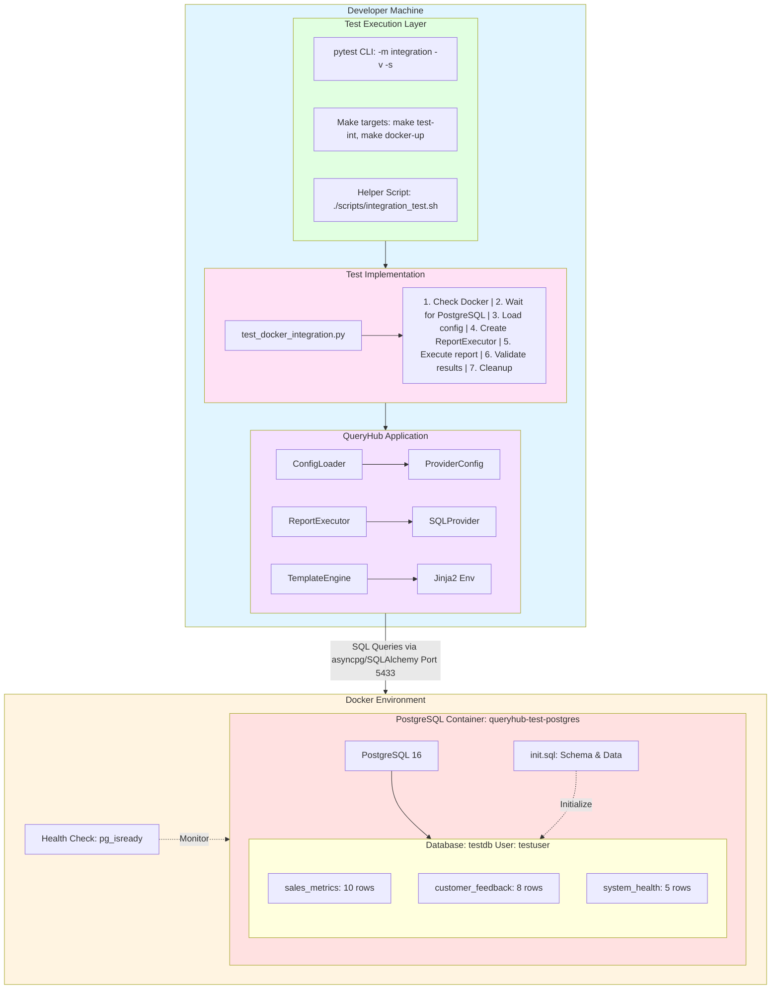
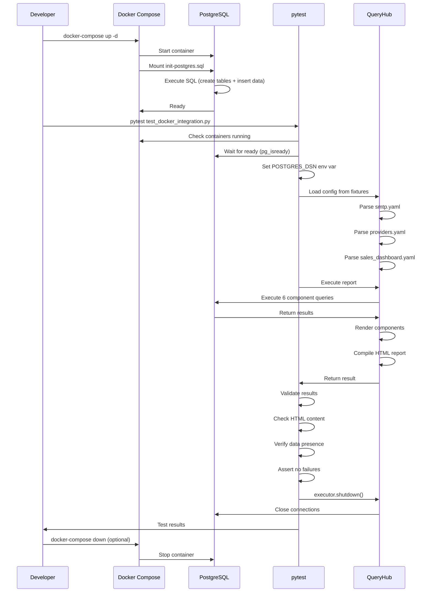
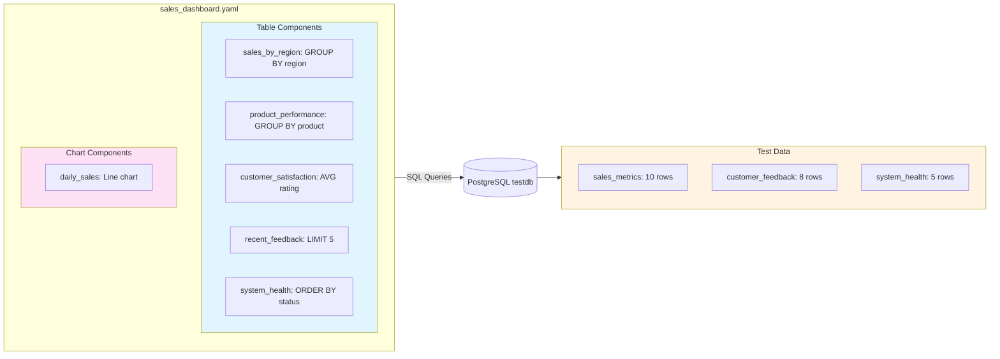
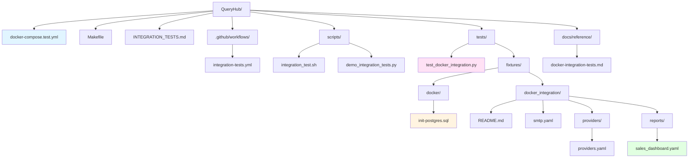
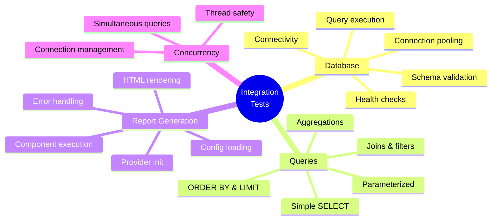
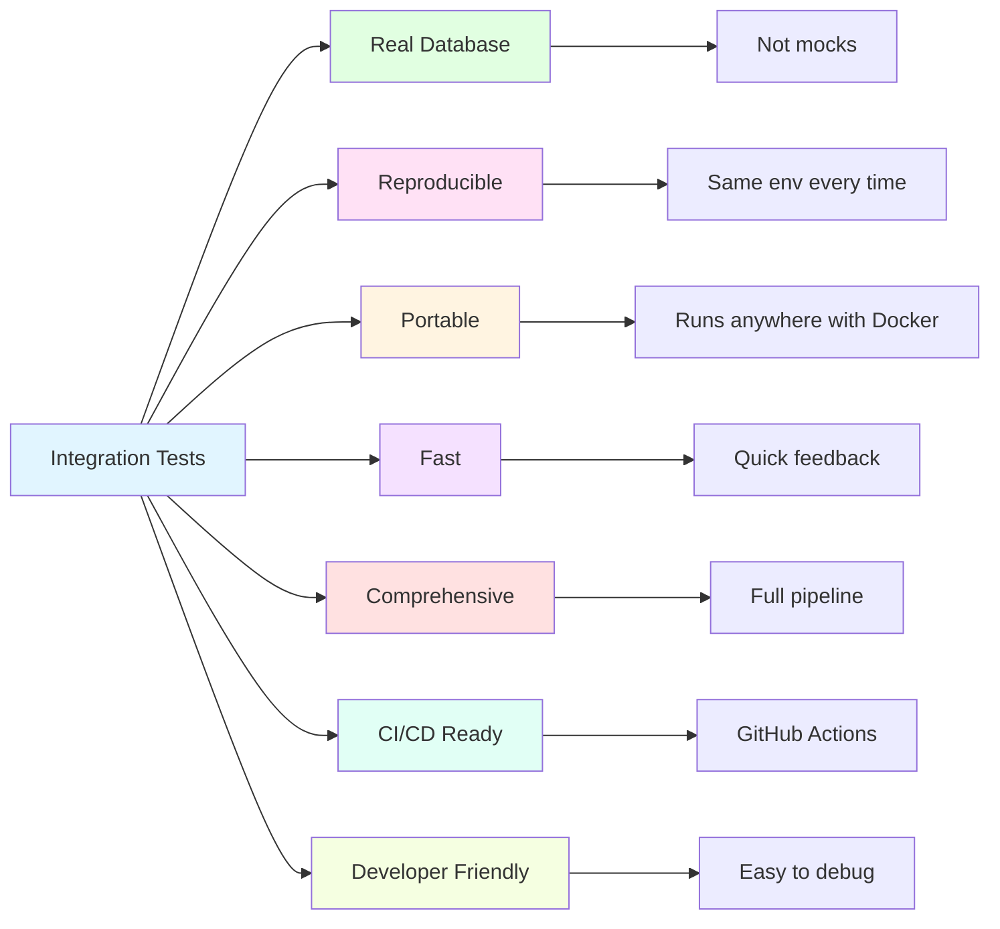
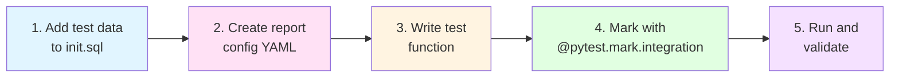
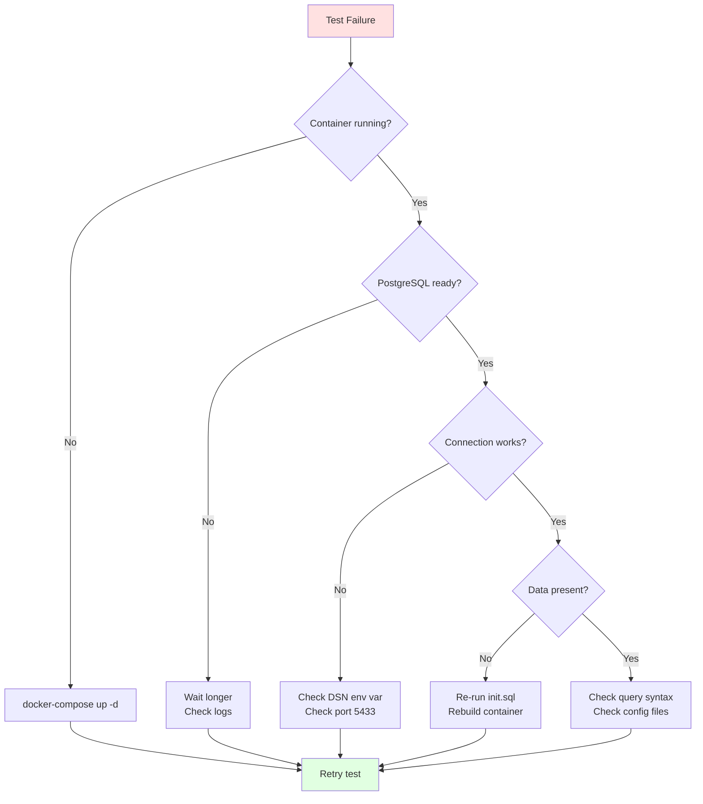

# QueryHub Docker Integration Test Architecture

## Overview

Comprehensive Docker-based integration test suite that validates QueryHub with real PostgreSQL databases.

## System Architecture



## Test Data Flow



## Report Components



## File Structure



## Test Coverage Matrix



## Commands Quick Reference

### Test Execution
```bash
# Start & Test
./scripts/integration_test.sh start
./scripts/integration_test.sh test

# Make targets
make docker-up
make test-integration
make postgres-shell

# Pytest
pytest tests/test_docker_integration.py -v -m integration
pytest -m "not integration"  # Skip integration tests
```

### Docker Management
```bash
# Start/Stop
docker-compose -f docker-compose.test.yml up -d
docker-compose -f docker-compose.test.yml down

# Shell access
docker exec -it queryhub-test-postgres psql -U testuser -d testdb

# Logs
docker-compose -f docker-compose.test.yml logs postgres
```

## Performance Metrics

```mermaid
gantt
    title Test Execution Timeline
    dateFormat  s
    axisFormat %Ss
    
    section Cold Start
    Container startup    :a1, 0, 10s
    PostgreSQL ready     :a2, after a1, 3s
    Schema initialization:a3, after a2, 2s
    
    section Test Execution
    Report execution     :b1, after a3, 1s
    Validation          :b2, after b1, 1s
    Cleanup             :b3, after b2, 1s
    
    section Warm Run
    Test suite (warm)   :c1, after b3, 5s
```



**Typical Times:**
- **Cold start**: 15-20 seconds
- **Warm start**: 5-10 seconds  
- **Report execution**: 100-200ms
- **Full test suite**: 15-20 seconds (cold), 5-10 seconds (warm)

## Key Benefits



## Maintenance & Extension

### Adding New Tests



### Troubleshooting Flow



## Summary

**What's Tested:**
- ✅ Real PostgreSQL database operations
- ✅ Full report generation pipeline  
- ✅ Complex SQL queries with aggregations
- ✅ Concurrent query execution
- ✅ Connection pooling
- ✅ Error handling

**What's Provided:**
- 🐳 Docker Compose setup
- 📊 Realistic test data
- 🧪 5 comprehensive test functions
- 🛠️ Helper scripts & Makefile targets
- 📚 Extensive documentation
- 🤖 GitHub Actions workflow

**Getting Started:**
```bash
./scripts/integration_test.sh start
./scripts/integration_test.sh test
```

---

*For detailed implementation guide, see: `INTEGRATION_TESTS.md`*  
*For fixture details, see: `tests/fixtures/docker_integration/README.md`*
